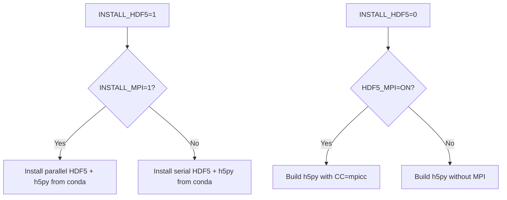

## Overview

HDF5 is the file format used by Dedalus for simulation output. The build scripts support both serial and parallel HDF5, with options to install from conda-forge or link to custom system libraries.

## Configuration Options

### INSTALL_HDF5

<ParamField path="INSTALL_HDF5" type="integer" default="1">
  Controls whether to install HDF5 from conda-forge.
  
  **Valid values:**
  - `1` - Install HDF5 from conda-forge (default)
  - `0` - Use custom HDF5 installation (requires HDF5_DIR)
</ParamField>

### HDF5_DIR

<ParamField path="HDF5_DIR" type="string" required="when INSTALL_HDF5=0">
  Path to your custom HDF5 installation prefix.
  
  Must be set when `INSTALL_HDF5=0`. The build will link against HDF5 libraries in this location.
</ParamField>

### HDF5_MPI

<ParamField path="HDF5_MPI" type="string" default="OFF">
  Indicates whether custom HDF5 was built with parallel (MPI) support.
  
  **Valid values:**
  - `"ON"` - Custom HDF5 has parallel support
  - `"OFF"` - Custom HDF5 is serial only (default)
  
  Only relevant when `INSTALL_HDF5=0`.
</ParamField>

## Parallel vs Serial HDF5

<Tabs>
  <Tab title="Parallel HDF5">
    Parallel HDF5 enables multiple MPI processes to write to the same HDF5 file simultaneously, improving I/O performance for large-scale simulations.

    ### From conda-forge

    ```bash
    # Automatically gets parallel HDF5 when using conda MPI
    INSTALL_MPI=1
    INSTALL_HDF5=1
    ```

    From the build script:
    ```bash conda_install_dedalus3.sh
    if [ ${INSTALL_HDF5} -eq 1 ]
    then
        if [ ${INSTALL_MPI} -eq 1 ]
        then
            echo "Installing parallel conda-forge hdf5, h5py"
            conda install "${CARGS[@]}" "hdf5=*=mpi*" "h5py=*=mpi*"
    ```

    ### Custom parallel HDF5

    ```bash
    INSTALL_HDF5=0
    export HDF5_DIR="/opt/hdf5/1.12.2-parallel"
    export HDF5_MPI="ON"
    ```

    From the build script:
    ```bash conda_install_dedalus3.sh
    if [ ${HDF5_MPI} == "ON" ]
    then
        echo "Installing parallel h5py with pip"
        # CC=mpicc to build with parallel support
        # no-cache to avoid wheels from previous pip installs
        # no-binary to build against linked hdf5
        CC=mpicc python3 -m pip install --no-cache --no-binary=h5py h5py
    ```

    <Info>
    When using custom parallel HDF5, h5py is built from source with `CC=mpicc` to enable parallel support.
    </Info>
  </Tab>

  <Tab title="Serial HDF5">
    Serial HDF5 is simpler but each MPI process writes to separate files.

    ### From conda-forge

    ```bash
    # Gets serial HDF5 when not using MPI
    INSTALL_MPI=0
    export MPI_PATH="/path/to/custom/mpi"
    INSTALL_HDF5=1
    ```

    From the build script:
    ```bash conda_install_dedalus3.sh
    else
        echo "Installing serial conda-forge hdf5, h5py"
        conda install "${CARGS[@]}" "hdf5=*=nompi*" "h5py=*=nompi*"
    fi
    ```

    ### Custom serial HDF5

    ```bash
    INSTALL_HDF5=0
    export HDF5_DIR="/usr/local/hdf5"
    # HDF5_MPI defaults to OFF
    ```

    From the build script:
    ```bash conda_install_dedalus3.sh
    else
        echo "Installing serial h5py with pip"
        # no-cache to avoid wheels from previous pip installs
        # no-binary to build against linked hdf5
        python3 -m pip install --no-cache --no-binary=h5py h5py
    fi
    ```
  </Tab>
</Tabs>

## Installation Decision Tree

The HDF5 variant installed depends on your MPI configuration:



## Validation

The build script validates HDF5 configuration:

```bash conda_install_dedalus3.sh
if [ ${INSTALL_HDF5} -ne 1 ]
then
    if [ -z ${HDF5_DIR} ]
    then
        >&2 echo "ERROR: HDF5_DIR must be set"
        exit 1
    else
        echo "HDF5_DIR set to '${HDF5_DIR}'"
        echo "HDF5_MPI set to '${HDF5_MPI}'"
    fi
fi
```

<Warning>
When `INSTALL_HDF5=0`, you **must** set `HDF5_DIR` or the build will fail.
</Warning>

## Building Custom HDF5

If you need to build HDF5 yourself:

### Parallel HDF5

```bash
# Download HDF5
wget https://support.hdfgroup.org/ftp/HDF5/releases/hdf5-1.12/hdf5-1.12.2/src/hdf5-1.12.2.tar.gz
tar -xzf hdf5-1.12.2.tar.gz
cd hdf5-1.12.2

# Configure with parallel support
CC=mpicc ./configure \
  --prefix=/opt/hdf5/1.12.2-parallel \
  --enable-parallel \
  --enable-shared

make -j
make install

# Use in build script
INSTALL_HDF5=0
export HDF5_DIR="/opt/hdf5/1.12.2-parallel"
export HDF5_MPI="ON"
```

### Serial HDF5

```bash
# Configure without parallel support
./configure \
  --prefix=/opt/hdf5/1.12.2-serial \
  --enable-shared

make -j
make install

# Use in build script
INSTALL_HDF5=0
export HDF5_DIR="/opt/hdf5/1.12.2-serial"
# HDF5_MPI defaults to OFF
```

## Platform Considerations

### Workstations and Laptops

For local development, conda-forge HDF5 is recommended:

```bash
# Simplest configuration - parallel HDF5
INSTALL_MPI=1
INSTALL_HDF5=1
```

### HPC Clusters

On HPC systems, use optimized system libraries:

```bash
# Load system modules
module load hdf5-parallel/1.12.2

# Configure build script
INSTALL_MPI=0
export MPI_PATH="/opt/mpi/openmpi-4.1.4"

INSTALL_HDF5=0
export HDF5_DIR="/opt/hdf5/1.12.2"
export HDF5_MPI="ON"
```

### Testing Serial vs Parallel

To test which HDF5 variant you have:

```bash
# Check if parallel
h5pcc -showconfig 2>/dev/null && echo "Parallel HDF5" || echo "Serial HDF5"

# Or check h5py
python3 -c "import h5py; print('Parallel' if h5py.get_config().mpi else 'Serial')"
```

## Common Patterns

<CodeGroup>

```bash Standard parallel build
# Everything from conda - parallel HDF5
INSTALL_MPI=1
INSTALL_HDF5=1
# Automatically gets parallel HDF5 and h5py
```

```bash Serial conda build
# Conda with custom MPI - serial HDF5
INSTALL_MPI=0
export MPI_PATH="/usr/local/openmpi"

INSTALL_HDF5=1
# Gets serial HDF5 since MPI not from conda
```

```bash HPC parallel build
# System libraries - parallel HDF5
INSTALL_MPI=0
export MPI_PATH="/opt/mpi/openmpi-4.1.4"

INSTALL_HDF5=0
export HDF5_DIR="/opt/hdf5/1.12.2-parallel"
export HDF5_MPI="ON"
```

```bash Mixed configuration
# Conda MPI with custom serial HDF5
INSTALL_MPI=1

INSTALL_HDF5=0
export HDF5_DIR="/usr/local/hdf5"
# HDF5_MPI defaults to OFF
```

</CodeGroup>

## Important Notes

<Note>
**From the build script comments:**

```bash
# Note: HDF5 from conda will only be built with parallel support if MPI is installed from conda
```

Conda-forge's HDF5 parallel support is tied to conda-forge MPI. If you use a custom MPI (`INSTALL_MPI=0`), conda will install serial HDF5.
</Note>

## Performance Considerations

### Parallel I/O Benefits

- Multiple MPI processes write to single file
- Better for post-processing and analysis
- Required for certain collective operations
- Reduced file count on parallel filesystems

### Serial I/O Characteristics

- Each MPI process writes separate files
- Simpler configuration
- May be faster on some filesystems
- Requires merging files for analysis

## Related Configuration

- [MPI Configuration](/configuration/mpi-setup) - HDF5 parallel support requires MPI
- [FFTW Configuration](/configuration/fftw-setup) - Another key scientific library